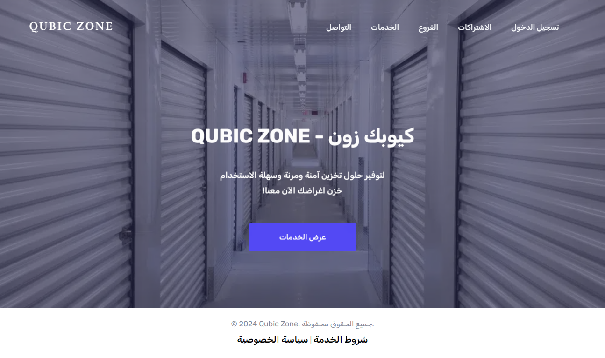

# IT473 Group Project: Qubic Zone: E-commerce platform for on-demand self-storage solutions

This is a project for IT473 e-commerce systems course. Our objective was to build and start a new business within the e-commerce domain. And complete the following tasks:
- **Business Planning**: Create a comprehensive plan for launching our new business.
- **Website/App Development**: Develop a functional e-commerce website.
- **Project Reporting**: Prepare an in-depth report detailing our project.
- **Presentation**: Present our project and demonstrate the website functionality.

Full report about our project idea is in [this pdf](./report.pdf). This repo will discuss the implmentaion of our website.

# Status: Completed ✅
The website is functional and both the report and presentation are ready. We've presented our work and we got full marks for the project.

# Features 
- **User Authentication**: Users can easily register and log in to interact with the platform securely.
- **User Interface**: A simple and intuitive web interface designed for seamless customer interactions.
- **View services**: Customers can browse a variety of storage options.
- **Submit an order**: Users can place orders for storage units with ease.
- **Track orders**: Customers can track the status of their orders and previous orders.



# Technologies Used
- **Frontend**: HTML, CSS, JavaScript.
- **Backend**: Laravel, PHP, Blade Templates.
- **Database**: SQLite.


# Skills Gained
- **E-Commerce Development**: Understanding of e-commerce platforms and their functionalities.
- **Web Development**: Enhanced skills in frontend and backend development.
- **Project Management**: Experience in planning, executing, and presenting a comprehensive project.
- **Team Collaboration**: Improved teamwork and communication skills through group collaboration.


# Installation
To set up the Qubic Zone project locally, follow these steps:
## Prerequisites
Make sure you have the following installed on your machine:
- [PHP](https://www.php.net/downloads) (version 7.3 or higher)
- [Composer](https://getcomposer.org/download/)
- [Laravel](https://laravel.com/docs/8.x/installation) (install via Composer)
- [SQLite](https://www.sqlite.org/download.html) (or any other preferred database)
## Clone the Repository
```bash
git clone https://github.com/CuzImAzizx/qubic-zone.git
cd qubic-zone
```
## Install Dependencies
Run the following command to install the required PHP packages:
```bash
composer install
```
## Configure Environment
Copy the example environment file and set up your environment variables:
```bash
cp .env.example .env
```
## Generate Application Key
Run the following command to generate the application key:
```bash
php artisan key:generate
```
## Run Migrations
Run the migrations to set up the necessary tables:
```bash
php artisan migrate # or php artisan migrate:fresh
```
## Seed the database
You need to seed the database with initial data.
```bash
php artisan db:seed
```
## Start the Development Server
You can now start the Laravel development server:
```bash
php artisan serve
```
Visit `http://localhost:8000` in your web browser to view the application.
